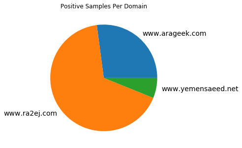
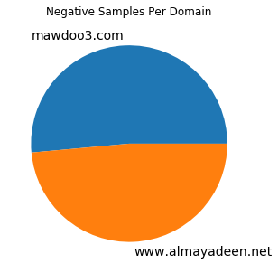

# General summary of the data

A training dataset for the clickbait classification problem, was annotated manually according to this [ticket](https://app.asana.com/0/1136791723054817/1137014317091547/f), where you can find the details about the annotation guidelines.

**The dataset size**: ~5000 samples.

## The data sources

**Psitive data sources (clickbait)** 
Multiple websites found to be filled with clickbait: 
1. [ra2ej](https://www.ra2ej.com/)
2. [yemensaeed](https://www.yemensaeed.com)
3. [arageek](https://www.arageek.com/)

Following is the distribution of the samples density over the source domains

**Negative data sources (not clickbait)** 
1. [mawdoo3](https://www.mawdoo3.com): varied topics, mostly non-clickbait headlines.
2. [almayadeen](https://www.almayadeen.net): political, mostly non-clickbait headlines.

Following is the distribution of the samples density over the source domains

## Dataset Fields Description

The dataset is provided in .csv format, where each record is composed from the following fields:

|Field|Description|
|-----|-----------|
|id|An automatically generated idintifier|
|url|A URL to the article|
|title|The title of the article|
|publish_date|The date when the article was published|
|meta_description|A brief description of the article, was taken from the meta data of the page|
|main_img|The URL of the lead image in the page|
|content|The content of the article|
|clickbait|Wether the article is clickbait or not|

## Target variable

The following graph shows the samples density distribution over the classes, they are obviously semi-balanced:

## Preprocessing steps

As we are concerned the most in the title of the article for this task, we performed the following preprocessing steps to the titles:
1. Strip Tashkeel
2. Strip Tatweel
3. Strip the small letters e.g. ۜ
4. Normalize Alefs e.g. أ -> ا
5. Normalize Teh Marbutah e.g. ة -> ه
6. Segmenting the punctuation and the numbers from the text.
