# General summary of the data

A dataset for modeling the clickbait classification problem, where the news articles are represented using simple features. 

## Modeling

The most important part of the news article for the clickbait classification problem is the headline of the article. In this dataset each headline is represented by a vector of variables that indicate simple features of the headline.

### Features set

The set of features that were taken into consideration: 
1. Presence/Number of some punctuation marks.
2. Presence/Number of numbers in the title.
3. Whether the title contains a number.
4. Presence/Number of question words.
5. Presence/Number of commonly used phrases in the clickbait headlines.
6. Presence/Number of emotional words in the title.
7. Presence/Number of forward-reference: Demonstratives pronouns, third person personal pronouns, ...

## Relationship between explanatory variables and target variable

### Common words & phrases

It’s obvious that there are many words and phrases commonlyused in a clickbait headline e.g. : 
 
**"أسباب"** 
7 _اسباب_ هامه للقيام بالتمارين الرياضية اثناء فتره الحمل 
6 _اسباب_ تجعل من جزيرة ميكونوس في اليونان وجهتك الافضل لقضاء عطله عيد فطر صيفيه مميزه 
العمل من المنزل مفيد لصحتك.. اليك _الأسباب_ 
**"شاهد"** 
_شاهد_ ماذا يأكل البشر كل يوم حول  العالم! 
_شاهد_ ماذا فعل اعضاء المنتخب الجزائري عقب فوزهم بكاس الامم الأفريقية.. «صوره مؤثره تشعل مواقع التواصل الاجتماعي 
عاجل... مفاجأة صادمه للجميع.. هذا ما حدث قبل قليل في السعودية بشأن الداعية سلمان العودة.. (_شاهد_ الصورة) 
 
**Common words/phrases determination**: 
 
We’ll use our training dataset to discover these words and phrases. Following are word-couldsvisualizethe densitiesof frequent words (1-gram) and phrases (2 -gram, 3-gram, 4-gram) in our clickbait headlines in the training dataset. 
**Frequent 1-gram**:
 

 
**Frequent 2-gram**:
 

 
**Frequent 3-gram**:
 

 
**Frequent 4-gram**:
 
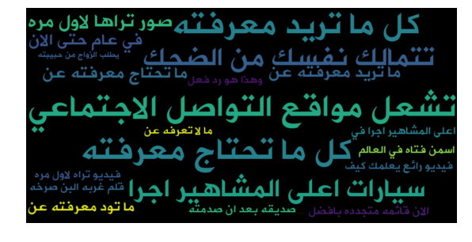
 
We are not going to use common words from the non-clickbait headlines as features, because this type of headlines has unlimited variations which are so hard to be covered in the training dataset, so using this kind of features may cause problems in the generalization on the real-world examples. However, we’re going to show the frequent words in the non-clickbait headlines as a part of the data exploration process. Following is a word-could visualizes the densities of the frequent words (1-gram) in our non-clickbait headlines in the training dataset.
 
**Frequent 1-gram**:
 

 

### Number Usage
It’s common to usenumbers in the clickbait headlines especiallyas the first word e.g. : 
 
_12_ فيلما يجب ان تشاهدهم للممثل... دانييل داي لويس  
_10_ افلام سينمائية عن ثورات الشعوب تستحق المشاهدة 
اكتشف _27_ بديلا في مشاهد الخطر لأكبر نجوم هوليوود 
 
The following graphconfirmsthe effectivenessof this featuresaccording to our training dataset, where we’re taking both the numericand textual numbers into account:
 
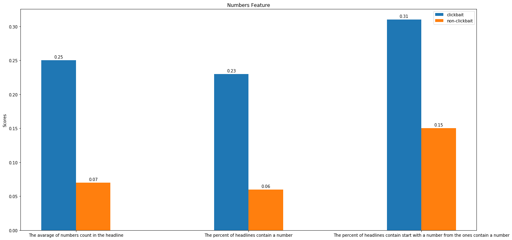
 
According to the previous graph: 
 
The average of numbers in a clickbait headline ~ 0.25, while the average of numbers in a non-clickbait headline ~ 0.07, because of this large difference we can consider “the count of the numbers in the headline” as an informative feature to differentiate between clickbait and non-clickbait headlines. 
 
The percent of the clickbait headlines that contain numbers and one of them is mentioned in the beginning of the headline 31%, while this percent is only 15% for the non-clickbait headlines, so the “the presence of a number in the beginning of the headline” can be considered as an informative feature to differentiate between clickbait and non-clickbait headlines too. 

### Punctuation Usage

It’s very common to over-formatting the clickbait headlines by using a lot of punctuation, for especially specific types like exclamation mark, question mark, full-stops, quotations... e.g. : 
 
مشاجرة عنيفة وتبادل مباشر للاتهامات والفاظ نابيه بين __”__اصاله__”__ و __”__احلام__”..__ والأخيرة تنهار على الهواء وتشتم الجميع__...__ شاهد 
تعرفوا على يونا المغنية المسلمة المحجبة التي حققت نجاحا عالميا في الموسيقى والموضة__..__ شاهدوا الصور والفيديو__!__ 
بالفيديو __:__ موقف محرج على الهواء__،__ شاهد ماذا فعل الكلب ليفسد النشرة الجوية __!!__ 
 
The following graphs show statistics related to the punctuation marks in the headlines in our training dataset:
 
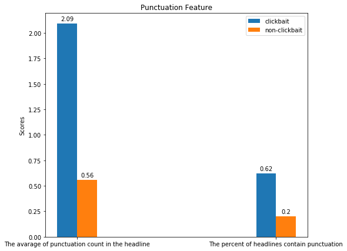
 
As the average of the punctuation marks per clickbait headline is ~ 2.09 and the percent of the clickbait headlines contain punctuation marks is ~ 62%, while the average of the punctuation marks per the non-clickbait headline is ~ 0.56 and the percent of the non-clickbait headlines contain punctuation marks is 2%, “the number/presence of punctuation in the headline” can be considered an informative feature to differentiate between clickbait and non-clickbait headlines.
 
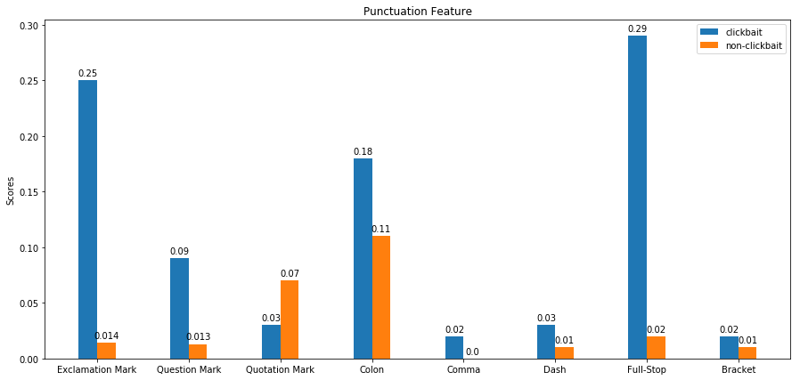
 
The previous graph shows the percent of the usage of each punctuation marks type in the both types of headlines. Where the punctuation marks were normalized i.e. (‘, “,’...) were normalized to “, (?, ‫)؟‬ were normalized to ? and so on.. 
 
The graph proves that the type of the used punctuation marks plays a role in differentiating between the two headline types and that according to our dataset, exclamation mark and full-stops play the biggest role in distinguishing the clickbait headlines, while the quotation marks seem to be effective in distinguishing the non-clickbait headlines! 
 

### The Presence of a Question

Question is a commonly used pattern in the clickbait headlines e.g. :
  
_كيف_ تحب الدراسة وتنمي شغف التعلم بداخلك؟ 5 خطوات تساعدك على فعل ذلك
فقالوا...انا مثقف!-_كيف_ تحكم على ثقافه أحدهم؟
قمر اوروبا... _هل_ يحقق حلم الحياة الاخرى في النظام الشمسي لدرب التبانة؟
 
The following graphs show statistics related to the question words present in the headlines:
 

 
 
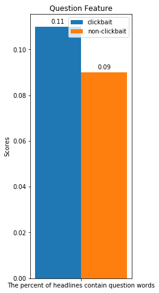
 
According to these graphs the presence of question words in the headline doesn’t seem to be an informative feature. However, the types of the used question words seem to be able to differentiate between the headline types. Where ( ‫ماذا‬ ، ‫هل‬ ) play the biggest role in distinguishing the clickbait headlines, while (‫أين‬ ،‫)كيف‬ seem to be effective in distinguishing the non-clickbait headlines. 

### Pronouns

Clickbait headlines usually use pronouns to refer to objects, persons and events.

### Demonstrative Pronouns

e.g. : 
 
انتبه... _هذا_ ما تفعله الوجبات السريعة في جسمك 
عائض القرني يعاود الظهور ويفجر مفاجأة: _هذا_ ما وعدنا به الملك سلمان 
انواع الطلاب في الجامعة، اي نوع من _هؤلاء_ انت؟ 
 
The following graphs show statistics related to the demonstrative pronouns present in the headlines, where the affixes were segmented from the pronouns. 
 
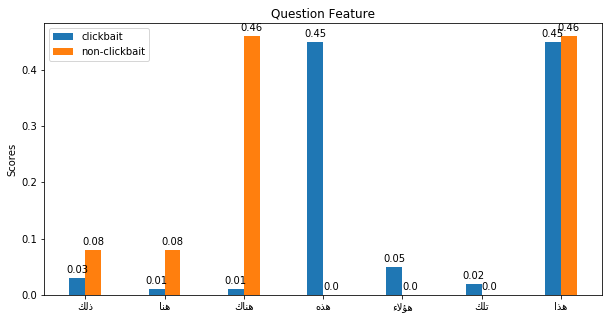
 
 
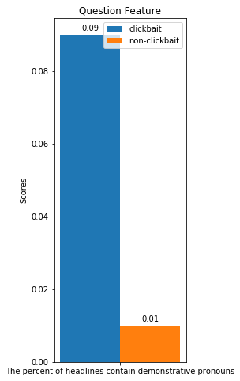
 
According to the previous graphs seems that the presence of a demonstrative pronoun can be considered as a good feature where the percent of the clickbait headlines that contain demonstrative pronouns is 9% while the percent of the non-clickbait headlines that contain demonstrative pronouns is just 1%. The types of the used demonstrative pronouns in the headlines are shown to have an effect in distinguishing between the types of the headlines too. 

### Relative Pronouns

هل تستطيع حل هذا اللغز _الذي_ فشل فيه 20الف شخص؟ 
اليزابيث هولمز... الشقراء _التي_ جمعت المليارات من وخز الابر 
 
The following graphs show statistics related to the relative pronouns present in the headlines, where the affixes were segmented from the pronouns. 
 
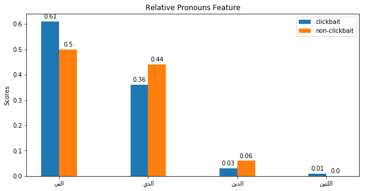
 
 
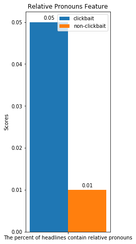
 
We can consider “the presence of a relative pronoun” as a good feature since the percent on clickbait headlines contain relative pronoun is 5% while the  percent of the non-clickbait ones contain relative pronouns is only 1%. However, the types of the relative pronouns that present in the headline don’t seem to play any role in distinguishing between the two types of the headlines. 

### Personal Pronouns

**Second-Person Pronouns** 
 
It’s common in the clickbait headlines to talk directly to the user. However, second-person pronouns are rarely used in Arabic. 
 
The following graph shows statistics related to the second-person pronouns present in the headlines, where the affixes were segmented from the pronouns. 
 
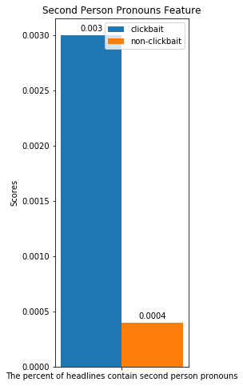
 
Both of the percent is low; thus, I don’t consider the presence of a second-person pronoun as an informative feature. 
 
**First and Third Person Pronouns** 
 
The following graph shows statistics related to the first and third pronouns present in the headlines, where the affixes were segmented from the pronouns. 
 
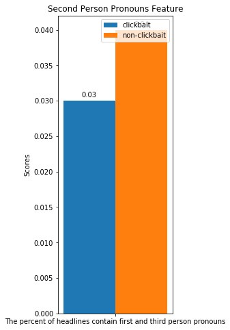
 

### Negation Formula

Negative words are often used in the clickbait headlineslike (لا، لم، لن) e.g. :   
افكار _لا تخطر_ على بالك عن استخدام البلالين 
ساحة جامع الفنا جمال مغربي _لا يقاوم_! 
نصائح للشباب في مقتبل عمرهم ... _لا تفوتها_! 
 "_لن تصدق_ مدى الشبه " شاهد شبيهه الفنانة اليمنية بلقيس 
جنون "عيد الحب " كما _لم تعرفه_ من قبل! 
 
The following graphs show statistics related to the negationwordspresent in theheadlines, where the affixes were segmented from the words.  
 
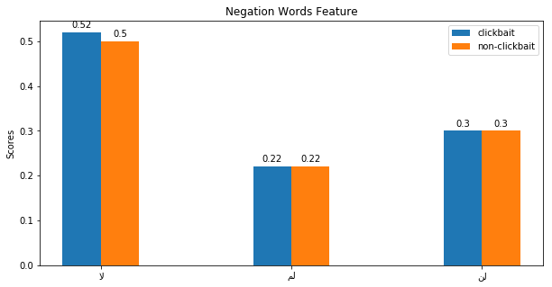
 
 
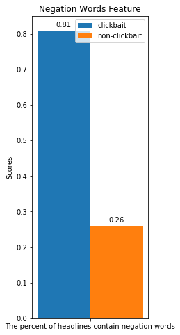
 
The percent of the clickbait headlines that contain negation pattern is ~ 8%, while the percent of the non-clickbait headlines that contain negation pattern is only ~ 3%, then we can consider the presence of a negation pattern as a good feature. However, the types of the presented negation words don’t seem to have any effect on the classification process. 

### Time Adverbs

Clickbait headlines usually contain time adverbs like ( ...،‫مع‬ ،‫حين‬ ،‫وقد‬ ،‫ما‬ ‫عند‬ ،‫عند‬ ) e.g. :  
 
فيديو.. لن تصدق ماذا فعل هذا الكلب _عند_ رؤية قطه 
صور استعمالات منزليه غريبه لم تعلم بها من _قبل_ للمايونيز... ستدهشك 
فيديو مرعب: _لحظه_ قتل رجل لزوجته في مراب تحت الأرض 
 
 
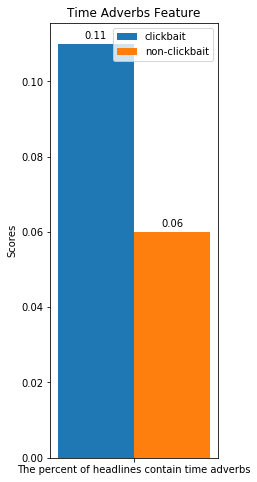
 
The percent of the clickbait headlines that contain time adverbs is~11%, while the percent of the non-clickbait headlines that contain time adverbs is only ~ 6%, then we can consider the presence of a time adverbsas a good feature. 

### Speaking toThe Reader

It’s commonly used in the clickbait headlines, and can be captured by the presence of many words like (عليك، إليك، إياك...) e.g. :  
 
لكل من يعاني من الم الظهر... _عليك_ باليوغا 
تعلم لغة اجنبيه مع العائلة والاصدقاء ... متعه وافاده _اليك_ كيف تستغلها 
الاماكن الاكثر سريه على سطح الارض.  .اياكوالاقتراب منه 
 
 
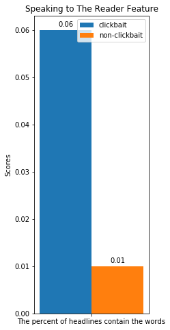
 
The percent of the clickbait headlines that contain those words is ~ 6%, while the percent of the non-clickbait headlines that contain those words is only ~ 1%, then we can consider this as a good feature. 

### Other Stopwords

Many other stopwords are commonly used in clickbait titles like ( ... ، ‫كل‬ ،‫فقط‬ ،‫قد‬ ) e.g. :  
 
اربعه اشياء _قد_ لا تعرفها عن التسويق عبر لينكدان! 
ما هي عمله ايوتا ... _كل_ ما تودون معرفته عنعمله ايوتا IOTAالمشفرة 
اقوى 20لعبه رعب على جميع المنصات لأصحاب القلوب القاسية والاحاسيس الميتة _فقط_! 
 
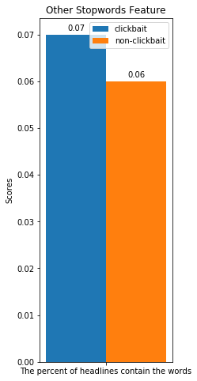
 
So, this feature doesn’t seem to be effective. 

### Emotional Words

Clickbait headlines often use emotional words. 
 
The following graphs show statistics related to the emotional words present in the headlines
 
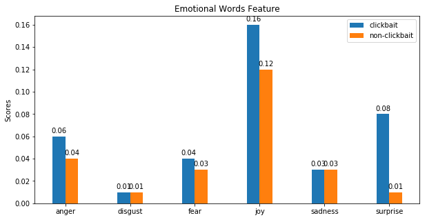
 
 

 
Obviously, the clickbait headlines contain more emotional words and the “surprise” emotion plays the biggest role in distinguishing the clickbait type.
 
 
The lexicon that was used to find the emotional words id downloadable from [here](https://github.com/motazsaad/emotion-lexicon/tree/master/arb).

