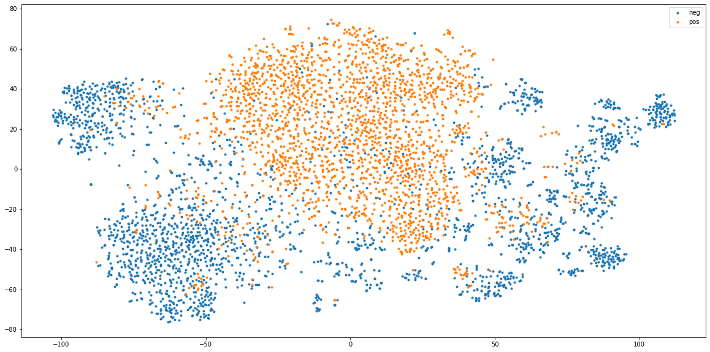

# General summary of the data

A dataset for modeling the clickbait classification problem, where the news articles are represented using Word2Vec representation. 
 
**The dataset size**: ~ 5000×300

## Modeling

### The pre-trained Word2Vec model

The used pre-trained Word2Vec model can be downloaded from [here](https://bakrianoo.sfo2.digitaloceanspaces.com/aravec/full_grams_sg_300_twitter.zip).
 It was trained on 66,900,000 documents from twitter.
 The whole vocabulary size is 1,476,715 unique words.
 The model was trained on n-grams e.x. can recognize multi-words terms like "بيل_غيتس".
 Its vector size is 300.
 It was trained using the Skip-Gram method.

### Method

The most important part of the news article for the clickbait classification problem is the headline of the article. In this dataset each headline is represented by a vector of size 300×1 using a pre-trained Word2Vec model by the following method:
1. For each word in the headline get the word vector using the pre-trained Word2Vec model.
2. Aggregate the vectors of all the words by averaging them.

## Relationship between explanatory variables and target variable

As the word2vec features are not easily interpretable, we investigated the projection of the training set headlines vectors on the two-dimensional space using the sklearn implementation for the [T-SNE](https://scikit-learn.org/stable/modules/generated/sklearn.manifold.TSNE.html) algorithm:
 

 
Where: 
**neg**: the negative class, means not a clickbait. 
**pos**: the positive class, means a clickbait. 
 
As we can see in the projection most of the clickbait headlines are grouped together in one cluster separated from the other not-clickbait headlines, so we can say that the this representation can effectively model our problem. 
 
Another remarkable thing from this projection is that the classes are not linearly separable.

