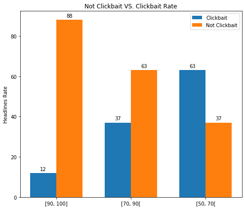
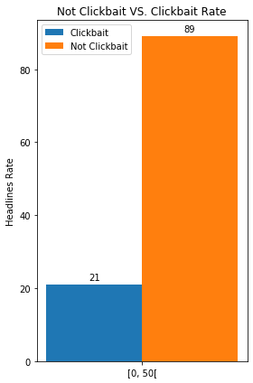

# Model Report
_A report to provide details on a specific experiment (model) - possibly one of many_ 

## Conclusion from the pervious experiments

### The types of the probable error sources

1. A clickbait pattern that isn’t frequent or not existed at all in the positive examples in our dataset. In this situation the model won’t learn any features related to this pattern, so it won’t be able to detect it. __(e1)__ 
2. A frequent pattern in the positive examples, while it’s rare in the negative ones (or not existed). However, this pattern is used in the negative class in the real world. This situation will lead the model to learn wrong strong features toward the positive class. __(e2)__ 
3. A frequent pattern in the negative examples (something related to the domain or the format of the data). This situation will lead the model to learn wrong features toward the negative class. In general, there’s always a risk in letting the model learn any features toward the negative class as it has an open unlimited distribution that can’t be covered by the training dataset. __(e3)__ 

### The discovered error sources during past experiments
One of the major discovered error sources is the Over-weighted features that act toward the positive class like the number of full-stops in the headline __(Error type e2)__

## Solution Description
We depended on the headlines of the articles in developing our solution. Each headline in the training set is preprocessed by:
1. Strip Tashkeel
2. Strip Tatweel
3. Strip the small letters e.g. ۜ
4. Normalize Alefs e.g. أ -> ا
5. Normalize Teh Marbutah e.g. ة -> ه
6. Segmenting the punctuation and the numbers from the text. 
Then, the headlines are passed to features extractors that represent each headline with a vector of simple features. After all, the features vectors are provided to the classification algorithm to learn how to distinguish between clickbait and not clickbait. 
 
To reduce the effect of full-stop in raising up the probability toward the positive class -which was remarked during previous experiments- we deleted the full-stops from a sample of clickbait headlines in the training dataset that actually contain full-stops.

## Data
* Source preprocessed dataset [report](https://github.com/almeta-io/Azure-TDSP-ProjectTemplate/blob/clickbait_doc/Docs/Data_Report/PreprocessedDataSummaryReport.md).
* Modeling dataset [report](https://github.com/almeta-io/Azure-TDSP-ProjectTemplate/blob/clickbait_doc/Docs/Data_Report/SimpleFeaturesModelingDataSummaryReport.md).
* Test dataset [report](https://github.com/almeta-io/Azure-TDSP-ProjectTemplate/blob/clickbait_doc/Docs/Data_Report/TestDataSummaryReport.md).

## Features
The set of features that were taken into consideration: 
1.  The number of some punctuation marks in headline (question mark, comma, quotation mark, bracket, exclamation mark, full-stop, dash, and colon)
2.  The number of numbers in the headline.
3.  Whether the title starts with a number.
4.  The number of question words.
5. Presence of commonly used phrases in the clickbait headlines specified in a list.
6.  The number of words that carry surprising emotion.
7.  The number of Demonstratives pronouns, third person personal pronouns, ...
8.  The number of relative pronouns
9.  The number of demonstrative pronouns
10. The number of second person pronouns
11. The number of time adverbs
12. The number of punctuation marks

## Algorithm
We used the sklearn implementation of [SGD Classifier](https://scikit-learn.org/stable/modules/generated/sklearn.linear_model.SGDClassifier.html) with the following hyper-parameters:
* loss=__’log’__
* penalty=’l2’
* alpha=0.0001
* l1_ratio=0.15
* fit_intercept=True
* max_iter=__10000__
* tol=0.001
* shuffle=True
* verbose=0
* epsilon=0.1
* n_jobs=None
* random_state=None
* learning_rate=’optimal’
* eta0=0.0
* power_t=0.5
* early_stopping=False
* validation_fraction=0.1
* n_iter_no_change=5
* class_weight=None
* warm_start=False
* average=False

## Results (Model Performance)

### Error Rate
In this section we are showing the error rate along the probability range, based on a manually inspection of a randomly sampled examples from our test dataset for each of the examined sub-range: 
__False Positive Error__ 
 

 
The error increases while approaching to 50. 
 
__False Negative Error__ 
 

 

## Model Understanding

As all our features values are binary or scaled to the range [0, 1], the trained model weights represent the importance of the features, and their signs represent the class that the feature acts toward.
* Larger weights mean higher effect on the model decision.
* Positive sign means toward the positive class (clickbait).
* Negative sign means toward the negative class (non-clickbait).
Following are the features weights according to out model: 
 

__+ 2.3__ COMM __– 0.2__ PUNC_COUNT __+ 2.5__ QS_MARK __+ 1.8__ COMMA __– 0.8__ QT_MARK __+ 1.8__ BRACKET __+ 3.0__ EXC_MARK __+ 1.5__ FULL_STOP __+ 0.7__ DASH __+ 1.0__ COLON __+ 2.0__ NUM_FIRST __+ 4.4__ NUM_COUNT __+ 5.0__ DEMON_PRON __+ 1.4__ NEG_WORDS __- 0.7__ Q_WORDS __+ 3.9__ REL_PRON __+ 1.2__ TIME_ADV __+ 3.3__ SEC_PER_PRON __+ 4.9__ SURPRISE 

 

__Where__:  

__COMM__ : The presence of one of the common word that are used in the context of clickbait headlines, from a pre-defined list. 
__PUNC_COUNT__ : The number of the punctuation in the headline. 
__QS_MARK__ : The presence of a question mark. 
__COMMA__ : The presence of a comma. 
__QT_MARK__ : The presence of a quotation mark.  
__BRACKET__ : The presence of a bracket. 
__EXC_MARK__ : The presence of exclamation mark. 
__FULL_STOP__ : The presence of a full-stop. 
__DASH__ : The presence of a dash. 
__COLON__ : The presence of a colon. 
__NUM_FIRST__ : The presence of a number in the beginning of the headline. 
__NUM_COUNT__ : The count of the numbers. 
__DEMON_PRON__ : The count of the demonstrative pronouns. 
__NEG_WORDS__ : The count of the negation words. 
__Q_Word__: The count of the question words. 
__REL_PRON__ : The count of the relative pronouns. 
__TIME_ADV__ : The count of the time adverbs. 
__SEC_PER_PRON__ : The count of second person pronouns. 
__SURPRISE__ : The count of words with surprise emotion. 

## Conclusion and Discussions for Next Steps

* A lot of features still over-weighted by the model which is reflected negatively on the results, as it causes a lot of situations where the model will fail to classify properly.
* Among all our experiments trying to get benifit from these simple features to solve the problem, this reported one has achieved the best performance.
* It seems that these simple features can't model the problem effectivly, thus we need more complex ones.

