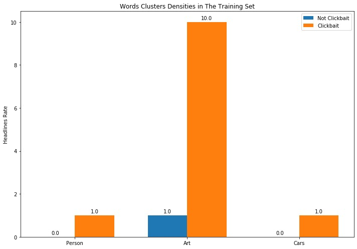

# Final Model Report
_Report describing the final model to be delivered_

## Solution Description
We depended on the headlines of the articles in developing our solution. Each headline in the training set is preprocessed by:
1. Strip Tashkeel
2. Strip Tatweel
3. Strip the small letters e.g. ۜ
4. Normalize Alefs e.g. أ -> ا
5. Normalize Teh Marbutah e.g. ة -> ه
6. Replace Alef Maksura with Yeh
7. Delete the repeated characters in the words 
8. Segmenting the punctuation and the numbers from the text. 
Then, the headlines are vectorized using a pre-trained word2vec model. After all, the vectors are provided to the classification algorithm to learn how to distinguish between clickbait and not clickbait.

## Data
* Source preprocessed dataset [report](https://github.com/almeta-io/Azure-TDSP-ProjectTemplate/blob/clickbait_doc/Docs/Data_Report/PreprocessedDataSummaryReport.md).
* Modeling dataset [report](https://github.com/almeta-io/Azure-TDSP-ProjectTemplate/blob/clickbait_doc/Docs/Data_Report/W2VModelingDataSummaryReport.md).
* Test dataset [report](https://github.com/almeta-io/Azure-TDSP-ProjectTemplate/blob/clickbait_doc/Docs/Data_Report/TestDataSummaryReport.md).

## Features
Features are described and evaluated in the modeling dataset [report]().

## Algorithm
We used the sklearn implementation of [Gradient Boosting Classifier](https://scikit-learn.org/stable/modules/generated/sklearn.ensemble.GradientBoostingClassifier.html) with the following hyper-parameters:
* loss=’deviance’
* learning_rate=0.1
* n_estimators=__80__
* subsample=__0.8__
* criterion=’friedman_mse’
* min_samples_split=__15__
* min_samples_leaf=1
* min_weight_fraction_leaf=0.0
* max_depth=__5__
* min_impurity_decrease=0.0
* min_impurity_split=None
* init=None
* random_state=None
* max_features=None
* verbose=0
* max_leaf_nodes=None
* warm_start=False
* presort=’auto’
* validation_fraction=0.1
* n_iter_no_change=None
* tol=0.0001

## Results

### Investigating The Probability Distribution Toward The Clickbait Class

Most of the headlines have low probabilities, which makes sense since clickbait is an anomaly characteristic, thus most of the headlines in the real-world should be not-clickbait.

### Investigating The Learned Features

In this section, we're trying to discover some of the features that were used by the model to separate the classes. 
Our method could discover simple features related to the words-type, and it’s as follows: 
1. Clustering the word2vec model vocabularies using their word2vec representation.
2. Finding the most appeared clusters in the headlines that were given a high probability toward clickbait.
3. Finding the words that belongs to each of these clusters in the headlines. 
Following are examples from our test set with the words of each cluster in bold: 

__Adjective__ 

بريد جستون تتلقي صدمه  تتلقي صدمه  __جديده__ 
سيده الشاشه  العربيه  محطات __مهمه__ في حياه فاتن حمامه 
بعد انستغرام فيسبوك تختبر ميزة __صادمه__ للمستخدمين 

__Words related to clickabit__ 

6__اسرار__ ..جمال رحله  منزليه لا تعرفها سوي المراه التركيه 
باختصار خمس __حقائق__ مثيره اصحاب  العيون  الخضراء  

__Time Adverbs__ 

__بعد__ ان تتلقي صدمه حير العلماء الكشف عن اصل وموطن الحشيش 
مغنيه  اميركيه  تعتنق الاسلام __بعد__ حادث نيوزلندا اشعر ببراءه الطفوله 

__Special stop words common to be used in clickbait__ 

من الاعتزال الى احضان الغوريلا حلا شيحه تثير الانتقادات __مجددا__ 
ناسا تقرر العوده برواد فضاء الي القمر __مره اخري__ 

__Question words__ 

__هل__ يمكنك البحث عن معلومه داخل فيديو؟ غوغل ترد 
__لماذا__ رفع احد منقذي فتيه الكهف في تايلاند قضيه على ايلون ماسك 

__Special stop words common to be used in clickbait including demonstrative pronouns__ 

فانتازيا بشائر طيبه __حينما__ تتفوق الدراما علي الروايه الاصليه 
لعشاق الايفون __هكذا__ سيصبح سعر الهاتف لو صنع في اميركا 
__فقط__ للنساء منتجات حلال من نوع خاص 
الكعب العالي __ذلك__ الالم الممتع الذي تعشقه السيدات 

__Currencies__ 

ارتداء الشورت في السعوديه يكلفك خمسه الاف __ريال__ 
وسم غرامه البيجامه الف __دينار__ يتصدر بالكويت والسبب 

__Superlative adjective__ 

__اطول__ رحله جويه في العالم تهبط في نيويورك فكم دامت 
هل يساريو اليد __اذكي__ __وانجح__ من يمينيي اليد 
بعد __اكبر__ عمليه اختراق للموقع كيف تحمي حسابك علي فيسبوك 
__اخطر__ الطرق للوصول الي المدارس في العالم 

### Error Rate
In this section we are showing the error rate along the probability range, based on a manually inspection of a randomly sampled examples from our test dataset for each of the examined sub-range: 
__False Positive Error__ 
 

 
The error increases while approaching to 50. 
 
__False Negative Error__ 
 

 
### Error Analysis
In this section we are investigating the errors types. 
 
__False positive error__: 
After checking a sample of headlines that were given probabilities higher than 50, we found some words-types that are frequently appeared in the false positive errors: 
 
_Type 1: Person related words_: 

يونيسيف __الاطفال__ يشكلون ثلث ضحايا تجاره البشر في العالم 
الصحف المصريه تركز الاهتمام علي مصرع __ابن__ كاهانا __وزوجته__ ومقررات القمه الخليجيه 

_Type 2: Cars related words_: 

سياره __هيونداي__ سانتا في بجيلها الرابع 
تحسين موديل اكس 4 من __بي ام دبليو__ 

_Type 3: Art related words_: 

ساره __والموسيقي__ مجموعه من __الاوركسترات__ الرائعه 
 وفاه __عازف__ __البيانو__ الشهير فيكتور بورغ 
 
The following graph shows the rate of each words-type in the false positive errors:
 

 
To investigate the presence of these words-types in the training set we follow the following method: 
1. Clustering the word2vec model vocabularies using their word2vec representation.
2. For each words-type we find its words cluster.
3. We calculate the rate of the headlines that contain words from this cluster in both clickbait and not-clickbait classes in the training set. 
The following graph shows the rates of the words-types in both classes in the training set: 

_Person words-type in the training set (clickbait class)_: 

تعرفوا على سبب اكل هذه __طفله__ لسجاد والرمل ! 
بالفيديو : لحظه انقاذ __فتاه__ حاولت الانتحار من اعلى مبنى 
صور __شاب__ يحول نفسه الى اميرات ديزني بمكياج يستحيل ان يكتشفه احد 

_Cars words-type in the training set (clickbait class)_: 

صور : سعودي يحصل على سياره __تويوتا__ هديه .. تعرف على السبب 
فيديو __سوبارو__ معدله تخرج من حفره عميقه بطريقه مذهله ! 
شاهد بالصوره ... عمر البشير بملابس بيضاء وسياره " __لاند كروزر__ "... اول ظهور للبشير منذ الاطاحه به 

_Art words-type in the training set (clickbait class)_: 

شمبانزي بدرجه فنان __يعزف__ على __الجيتار__ بطريقه رائعه 
بالفيديو : اب يشارك طفلته __رقصه__ مجنونه برفقه المكنسه 
رد فعل مفاجئ لانثى اسد لم يعجبها __عزف__ احد الزوار 

To conclude, the model may be affected by the domains of the articles that was trained on, to overcome these errors we can add more not-clickbait headlines that include these words-types.
 

P.S. maybe there are other domains that are not presented in our test data.

